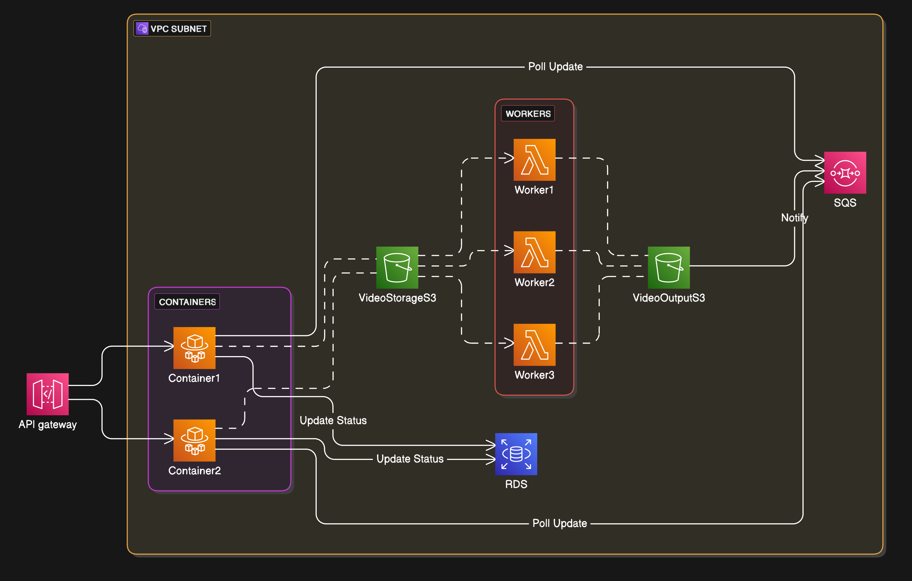

# Scalable Video Transcoder



## Table of Contents
1. [About](#about)
2. [Application Running Steps](#application-running-steps)
3. [Technologies Used](#technologies-used)
4. [Particular Challenges Resolved](#particular-challenges-resolved)
5. [Diagram Explanation](#diagram-explanation)
6. [How the Project Works](#how-the-project-works)

---

### About

This project is a **Video Transcoding Application** that accepts video uploads, processes them using AWS Lambda with FFmpeg, and notifies the user upon completion. It uses a **serverless architecture** integrated with AWS services like ECS fargate, S3, SQS, and RDS (PostgreSQL) for efficient processing and scalability.

---

### Application Running Steps

1. Clone the repository:
   ```bash
   git clone https://github.com/Abdul-pitodia/video-transcoder.git
   cd video-transcoder
   ```
2. Setup the environment variable file (.env file):
   ```.env
    AWS_REGION=<region>
    S3_BUCKET_VIDEO_STORAGE=<bucket-name>
    S3_BUCKET_VIDEO_OUTPUT=<bucket-name>
    POSTGRES_HOST=<host>
    POSTGRES_PORT=<port>
    POSTGRES_USER=<user>
    POSTGRES_PASSWORD=<password>
    POSTGRES_DB=<database>
    SQS_QUEUE_URL=<queue-url>
    CORS_ORIGIN=<cors-origin>
   ```
3. Ensure the following external services are set up:

  - AWS S3: Two buckets (VideoStorageS3 and VideoOutputS3).
  - AWS SQS: Queue to manage job status updates.
  - AWS Lambda: With an FFmpeg layer to process video files.
  - AWS ECS (Optional): AWS Serverless Container Runtime
  - PostgreSQL Database: Hosted on RDS or locally (using docker compose).

4. Once the above steps are complete, you can run:

   ```bash
   docker-compose up --build
   ```

   The docker compose file already has a volume mount that will mount the credentials you have in ~/.aws into the docker container with read-only permissions. Ensure you have an existing        credentials file, or use ```aws sso login``` if you have Identity center in AWS IAM configured to fetch temporary credentials. These credentials are necessary for the application to listen to the messages from SQS and upload video to S3 bucket.
   The compose file also runs the typeorm migrations that automatically set up the required schema and the tables required for the application.

---

### Technologies Used:

  - AWS ECS Fargate: The NestJS backend runs on serverless ECS fargate, it acts as an orchestrator to accept video conversion requests and update their status. This scales based on load.
  - React: Frontend for user interaction to upload videos and choose target resolution and format for conversion, and completion status tracking.
  - AWS S3: Storage for uploaded and processed video files.
  - AWS SQS: Queue to handle communication between services.
  - AWS Lambda: Python function that executes video transcoding with FFmpeg CLI, this is the compute service which is horizontally scalable depending on the load.
  - Python: Lambda function to run FFmpeg subprocesses.
  - PostgreSQL (RDS): Stores the metadata of the submitted video conversion jobs, used to keep track of conversion status.

---

### Particular Challenges Resolved:

**Asynchronous Job Status Updates**: 
- The Frontend keeps polling the backend app periodically to be updated about the video processing status. This required using PostgreSQL for tracking video transcode job submissions and SQS to asynchronously notify the NestJS backend. This ensures that frontend can update the status of the submitted video conversion tasks.

---

### Diagram Explanation

The provided architecture illustrates:

  - **Frontend requests** routed via the API Gateway to the NestJS containers.
  - **File upload triggers** an S3 event notification to an AWS Lambda.
  - **Lambda processes** the video using FFmpeg and uploads the result to an output bucket.
  - **The output bucket notifies** the SQS queue, which is monitored by the NestJS backend for updates.
  - **Status updates** are stored in RDS (PostgreSQL) and fetched by the frontend.
---

### How the Project Works

1. Frontend to Backend Communication:
   - A user uploads a video via the frontend, which sends a request to the API Gateway. The gateway routes the request to one of the NestJS application containers that is running on ECS Fargate.

2. Video Upload and Validation:
   - The NestJS backend exposes an /uploadVideo endpoint that validates the video file, uploads it to the VideoStorageS3 bucket in the format ```(uuid/format/resolution/video_file.mov)```, and creates an entry in the PostgreSQL database with a uuid and other metadata like target format and target resolution.

3. Triggering Lambda Processing:
   - Once the video is uploaded, the VideoStorageS3 bucket triggers an event notification to an AWS Lambda function.

4. Lambda Video Processing:
   - The Lambda function, written in Python, extracts the key (file path in storage bucket) from the event ```(uuid/format/resolution/video_file.mov)```. For the actual video conversion, a lambda layer of ffmpeg is used, which is a CLI tool to convert video from one format to another. Using the ```FFmpeg layer```,  lambda invokes a subprocess that is basically to submit a CLI command to invoke ffmpeg for starting the video conversion. The processed video is saved in the VideoOutputS3 (output) bucket with a similar key format ```(uuid/format/resolution/file.target_format)```

5. SQS Notification:
   - The VideoOutputS3 bucket triggers an event upon upload completion, sending the event details to an SQS queue.

6. Backend Polling for Updates:
   - The NestJS application keeps listening to the SQS queue via aws-sdk and keeps receiving messages. Upon receiving an event, it parses the bucket name, key, and uuid. It also updates the corresponding video’s status in PostgreSQL to completed, by updating the completion status of the same uuid.

7. Frontend Polling for Statuses:
   - The frontend polls the /fetchStatus endpoint to retrieve the status of submitted jobs, enabling users to see live updates.

   
